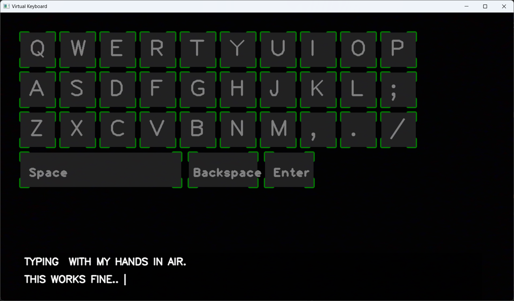
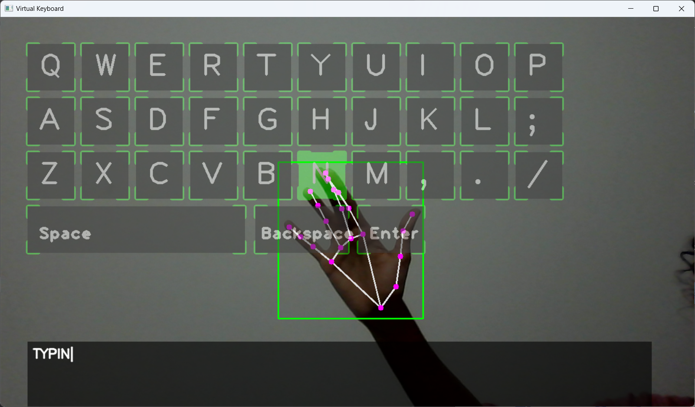

# 👋 **Gesture-Controlled Virtual Keyboard**
*A Computer Vision Project for Touchless Typing*

**Keywords**: Real-Time Computer Vision, Human-Computer Interaction, MediaPipe, OpenCV, Python

---




## 🎯 **Project Overview**
An intelligent virtual keyboard system that enables touchless typing through hand gesture recognition. Built using MediaPipe's hand tracking capabilities and OpenCV for real-time video processing, this project demonstrates practical applications of computer vision in human-computer interaction.

**Key Features:**
- ✅ **Real-Time Hand Tracking**: Leverages MediaPipe's 21-landmark hand detection model
- ✅ **Gesture-Based Input**: Pinch gestures for key selection and typing
- ✅ **Visual Feedback System**: Interactive UI with key highlighting and selection confirmation
- ✅ **Cross-Platform Compatibility**: Works on Windows, macOS, and Linux
- ✅ **Accessibility Applications**: Enables touchless interaction for medical/sterile environments

---

## 🛠 **Technical Architecture**

### **Core Technologies**
| **Component**       | **Technology**   | **Purpose**                     |
|---------------------|------------------|---------------------------------|
| Hand Detection      | MediaPipe        | Real-time hand landmark extraction |
| Computer Vision     | OpenCV           | Video capture and image processing |
| Keyboard Simulation | `pynput`         | System-level keypress generation |
| UI Framework        | OpenCV GUI       | Lightweight virtual keyboard interface |
| Mathematical Ops    | NumPy            | Efficient distance calculations |

### **System Workflow**
```
Camera Input → MediaPipe Processing → Hand Landmark Detection →
Gesture Classification → Key Selection → Visual Feedback → Keystroke Output
```

---

## 🚀 **Implementation Details**

### **Hand Gesture Recognition**
```python
def detect_pinch_gesture(self, landmarks):
    """
    Detects pinch gesture using thumb and index finger landmarks
    Returns: (is_pinching: bool, pinch_strength: float)
    """
    thumb_tip = np.array([landmarks[4].x, landmarks[4].y])
    index_tip = np.array([landmarks[8].x, landmarks[8].y])

    # Calculate normalized distance
    distance = np.linalg.norm(thumb_tip - index_tip)
    normalized_distance = distance * frame_width  # Convert to pixel space

    is_pinching = normalized_distance < self.pinch_threshold
    return is_pinching, normalized_distance
```

### **Key Selection Algorithm**
```python
def get_selected_key(self, index_finger_pos):
    """
    Maps finger position to virtual keyboard layout
    Uses spatial proximity to determine intended key
    """
    for key_data in self.keyboard_layout:
        key_center = (key_data['x'] + key_data['w']//2,
                     key_data['y'] + key_data['h']//2)

        if self.point_in_rectangle(index_finger_pos, key_data):
            return key_data['key']
    return None
```

---

## 📂 **Setup & Installation**

### **System Requirements**
- Python 3.7+
- Webcam/Camera access
- Operating System: Windows 10+, macOS 10.14+, or Ubuntu 18.04+

### **Installation Steps**
```bash
# Clone the repository
git clone https://github.com/jac1na/virtualkeyboard.git
cd virtualkeyboard

# Create virtual environment (recommended)
python -m venv venv
source venv/bin/activate  # On Windows: venv\Scripts\activate

# Install dependencies
pip install -r requirements.txt
```

### **Dependencies**
```txt
opencv-python==4.8.1.78
mediapipe==0.10.7
pynput==1.7.6
numpy==1.24.3
```

### **Running the Application**
```bash
python virtual_keyboard.py
```

**Usage Instructions:**
- 👆 **Point**: Move index finger to hover over desired keys
- 🤏 **Pinch**: Bring thumb and index finger together to press the selected key
- 👁️ **Visual Cues**: Selected keys highlight in real-time
- ⌨️ **Output**: Typed characters appear in any active text field
- **Exit**: Press 'Q' key or close the window

---

## 🔧 **Engineering Challenges & Solutions**

### **Challenge 1: Gesture Stability**
**Problem**: Natural hand movements caused unintended key presses during normal gesturing.

**Solution**: Implemented a debounce mechanism with temporal filtering:
```python
def is_stable_gesture(self, current_gesture, min_duration=0.3):
    """Ensures gesture is held consistently before triggering action"""
    if current_gesture != self.last_gesture:
        self.gesture_start_time = time.time()
        self.last_gesture = current_gesture
        return False

    return (time.time() - self.gesture_start_time) > min_duration
```

### **Challenge 2: Lighting Sensitivity**
**Problem**: Hand detection accuracy varied significantly under different lighting conditions.

**Approach**: Enhanced preprocessing pipeline with adaptive thresholding and histogram equalization to normalize input frames before MediaPipe processing.

### **Challenge 3: Coordinate System Mapping**
**Problem**: Converting MediaPipe's normalized coordinates (0-1) to screen pixel coordinates for accurate key selection.

**Solution**: Implemented robust coordinate transformation with aspect ratio preservation:
```python
def normalize_coordinates(self, landmark, frame_shape):
    """Convert MediaPipe landmarks to pixel coordinates"""
    h, w = frame_shape[:2]
    return int(landmark.x * w), int(landmark.y * h)
```

---

## 🎨 **User Interface Design**

### **Virtual Keyboard Layout**
- **QWERTY Layout**: Standard keyboard arrangement for familiar user experience
- **Visual Feedback**: Keys change color on hover and selection
- **Status Indicators**: Real-time display of hand detection status
- **Typing Display**: Shows currently typed text for immediate feedback

### **Accessibility Features**
- **High Contrast Mode**: Enhanced visibility for users with visual impairments
- **Adjustable Sensitivity**: Customizable pinch threshold for different user preferences
- **No-Touch Operation**: Completely contactless interaction suitable for sterile environments

---

## 📊 **Technical Specifications**

### **Performance Considerations**
- **Frame Processing**: Optimized for real-time operation on consumer hardware
- **Memory Usage**: Efficient landmark caching to minimize computational overhead
- **Latency**: Direct OpenCV-to-MediaPipe pipeline for minimal input delay

### **Limitations & Future Work**
- **Single Hand Support**: Currently processes one hand at a time
- **Gesture Set**: Limited to pinch gestures (expandable architecture for additional gestures)
- **Keyboard Layout**: Fixed QWERTY layout (modular design allows easy customization)

---

## 🔮 **Future Enhancement Roadmap**

### **Planned Features**
- [ ] **Multi-Hand Support**: Simultaneous tracking of both hands for faster typing
- [ ] **Custom Gesture Training**: Allow users to define personalized gesture commands
- [ ] **Predictive Text Integration**: Implement autocomplete using n-gram models
- [ ] **Voice Command Hybrid**: Combine gesture and voice input for enhanced accessibility
- [ ] **Mobile Deployment**: Port to mobile platforms using TensorFlow Lite

### **Technical Improvements**
- [ ] **Model Optimization**: Implement custom lightweight hand detection for edge devices
- [ ] **Gesture Recognition ML**: Train classifier for more complex hand gestures
- [ ] **Real-time Analytics**: Add gesture accuracy and typing speed metrics
- [ ] **Configuration GUI**: User-friendly settings interface for customization

---

## 🎓 **Learning Outcomes & Skills Demonstrated**

### **Computer Vision Expertise**
- Real-time video processing and analysis
- Understanding of MediaPipe's ML pipeline architecture
- Practical experience with coordinate system transformations
- Implementation of robust gesture recognition algorithms

### **Software Engineering Practices**
- Modular code architecture for maintainability and extensibility
- Error handling and edge case management
- User experience design for accessibility applications
- Integration of multiple APIs and libraries

### **Problem-Solving Approach**
- Systematic debugging of computer vision challenges
- Performance optimization for real-time applications
- User-centered design thinking for accessibility technology

---

## 👩‍💻 About the Developer

**🎓 Jasina **
AI Engineering Student | 🤖 Computer Vision Enthusiast

This project is part of my journey into building real-world applications using **computer vision** and **gesture-based interfaces**. I’m passionate about creating **accessible, human-friendly tech** that bridges the gap between humans and machines.

Feel free to explore more of my work or connect with me!

### 🌐 Connect with Me

- 💼 **LinkedIn**: [linkedin.com/in/jasina-mj-782968353](https://www.linkedin.com/in/jasina-mj-782968353)
- 🌟 **GitHub**: [github.com/jac1na](https://github.com/jac1na)
- 📧 **Email**: [jazsina7@gmail.com](mailto:jazsina7@gmail.com)

[](https://www.linkedin.com/in/jasina-mj-782968353)
[](https://github.com/jac1na)

---

## 📄 **License**
This project is licensed under the MIT License - see the [LICENSE](LICENSE) file for details.

---

## 🤝 **Contributing**
Contributions, issues, and feature requests are welcome! Feel free to check the [issues page](../../issues) if you want to contribute.

1. Fork the project
2. Create your feature branch (`git checkout -b feature/AmazingFeature`)
3. Commit your changes (`git commit -m 'Add some AmazingFeature'`)
4. Push to the branch (`git push origin feature/AmazingFeature`)
5. Open a Pull Request

---

*This project showcases practical applications of computer vision in accessibility technology and demonstrates proficiency in real-time ML systems development.*